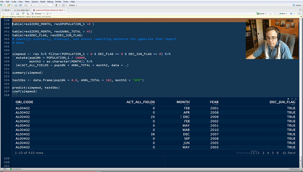

### When is the next stream?

For the week of 09/19/2016 the plan is to stream:

09/20 - 2pm - 3pm Eastern
09/21 - 2pm - 3pm Eastern
09/22 - 9:30am - 11am Eastern
09/23 - 3pm - 4:30pm Eastern

Check out my [Twitter account for updates](www.twitter.com/jknowles).

### Where can I find it?
[YouTube Channel](https://www.youtube.com/user/debatemanjk)

### What is this?

I'm livestreaming myself doing data science. You can find out more about
[why I am livestreaming](pages/whystream.html) here, and about the project I
am working on [here](pages/project.html).

### What project are you working on?

I'm attempting to import, clean, combine, and analyze dozens of years of FBI
Uniform Crime Reports and other data associated with the criminal justice system
in the United States. [Read more](pages/project.html)

I'm not doing any "deep learning" or analyzing what you might think of as big data.
I'm analyzing moderately sized public datasets using R. I'm not doing any machine
learning as of yet, because that's really about 10% of being a data scientist.
Right now I'm using the packages in the `tidyverse` to munge, reshape, clean, and
diagnose these large administrative record sets.

### Who am I?

I'm a former data scientist for the state of Wisconsin who is now an independent
statistical programming and research consultant. You can find out more about me
on my [homepage](www.jaredknowles.com).

### What will I see on the livestream?

Just me, my [RStudio](www.rstudio.com) window (set to use notebooks) and my intermittent narration
of my thought process as I work through a problem.

### What data science are you doing?

This week I'm mostly working on smoothing out inconsistencies in reporting by
agency and year for common and known reporting irregularity. This involves
writing a lot of logical statements, fitting some simple models, and smoothing
the data out by applying those models.
